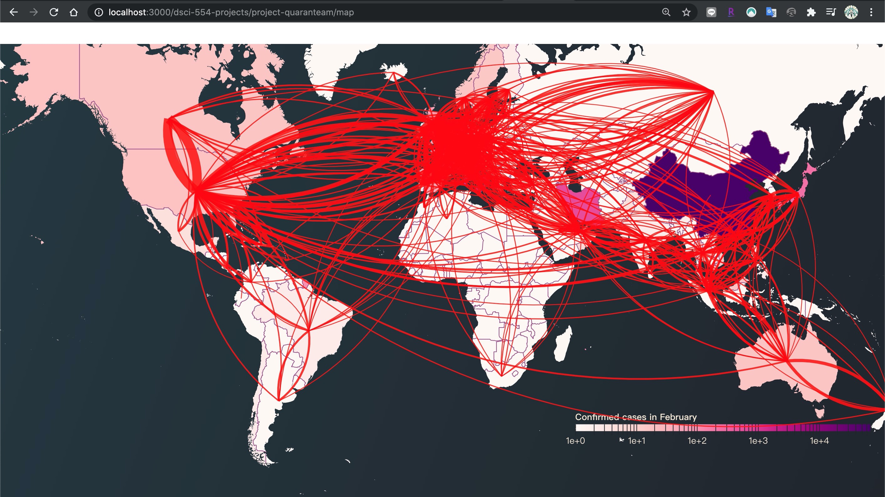

# DSCI 554 Project [Data Visualization]

## Team

Team members:

- Sanya Singh
- Prajakta Khandve
- Chia-Chi Dai
- Simran Makandar
---

## Artifacts

---

## Project Summary

As we are living through pandemic and with much of the world closed for business, it may be months before airlines could operate flights as they did before. Multiple airlines have already gone bankrupt and are out of business, we have Avianca, Virgin Australia Trans States Airlines and a few more. Our viz shows the changes in the number of flights, when the drop actually happened (April, May and June) and also user can visualize the steady recovery of travel.

---

### List of visualizations

| Requirement                          | Label       |
| ------------------------------------ | ----------- |
| responsive d3 chart                  | responsive  |
| interactive d3 chart                 | interactive |
| d3 chart with an animated transition | animated    |
| d3 layout                            | layout      |
| d3 map                               | map         |
| Mapbox map                           | mapbox      |

Table 1: Table of minimum requirements, 1 of each category is required.

In Table2, list all the charts and tables in your pages including minimum requirements labels when applicable.

| Page name       | Chart description | Libraries used | Requirement label |
| --------------- | ----------------- | -------------- | ----------------- |
| Map             | main map          | d3, topojson   | map               |
| Region-wise     | Multi-line chart  | d3             | responsive        |
| Region-wise     | Arc diagram       | d3             | interactive       |
| Region-wise     | Bar graph         | d3             | animated          |
| Region-wise     | Arc Diagram       | d3             | layout            |
| Airports-Mapbox | Mapbox map        | d3, mapbox-gl  | mapbox            |
| Airports        | Radial Graphs     | d3             |                   |
| Airports        | Donut Charts      | d3             |                   |
| Airports        | Stream Graph      | d3             |                   |

Table2: Table of visualizations

## Important Note

Due to unforeseen reason and the lack of time to figure out the deployment issue, there's an issue with the map page where the **arc on deployed website are not shown properly as running on localhost**. Therefore, Please kindly run it on localhost to check the arcs on map locally. Thank you very much!

